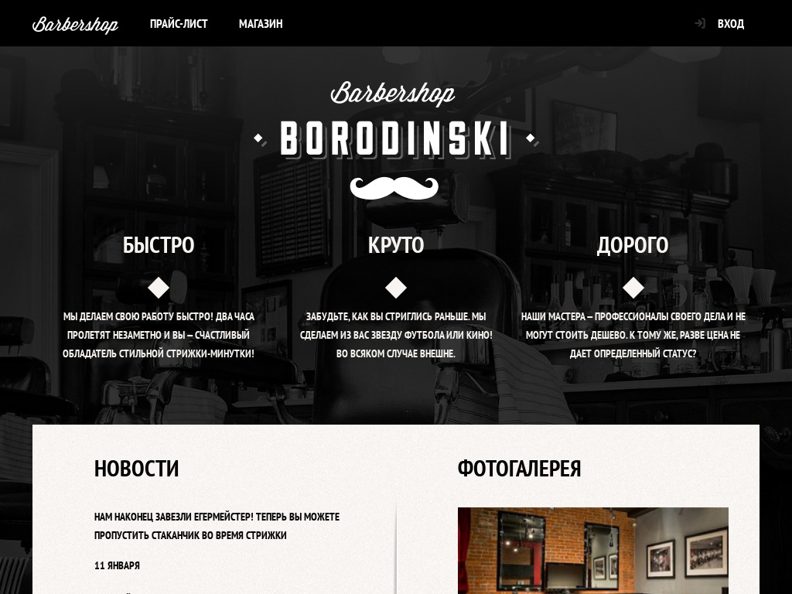

<p align="center">
  
</p>

# Barbershop

Multi-page template of the barber shop website, adaptability, component approach, all data is static. Please consider this site as one of the portfolio works.

## [Demo](https://barbershop-tau.vercel.app/)


## Run Locally

Clone the project

```bash
  git clone https://github.com/shock-dev/barbershop.git
```

Go to the project directory

```bash
  cd barbershop
```

Install dependencies

```bash
  npm install
```

Start the server

```bash
  npm run serve
```
